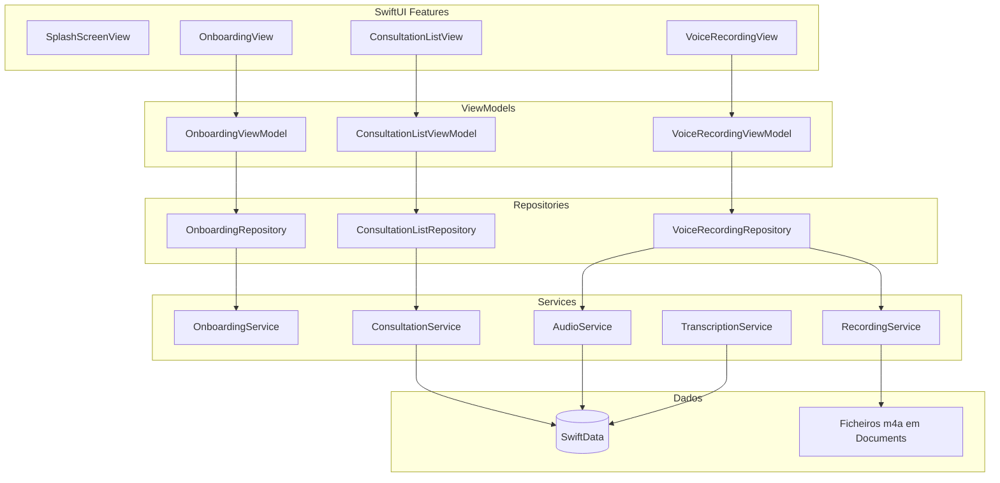

# Arquitetura

## Visão geral

O Clairfy segue um padrão em **camadas**:

**View (SwiftUI)** → **ViewModel (`@Observable`)** → **Repository (protocolo)** → **Service (protocolo)** → **SwiftData** ou **AVFoundation**.

As Views não acedem a `ModelContext` diretamente nos fluxos documentados; os serviços de persistência encapsulam fetch/insert/update/delete.

## Fonte no repositório

| Conceito | Local |
|----------|--------|
| Entrada e `modelContainer` | [`ClairfyApp/App/ClairfyApp.swift`](../ClairfyApp/App/ClairfyApp.swift) |
| Container SwiftData partilhado | [`ClairfyApp/Services/Persistence.swift`](../ClairfyApp/Services/Persistence.swift) |
| Protocolos de repositório | [`ClairfyApp/Repositories/`](../ClairfyApp/Repositories/) |
| Serviços | [`ClairfyApp/Services/`](../ClairfyApp/Services/) |

## Diagrama de camadas (simplificado)

## Modelos SwiftData

Definidos em [`ClairfyApp/Models/Persistence/`](../ClairfyApp/Models/Persistence/):

- **`Consultation`** — `id`, `title`, `date`; relações em cascade para `AudioFile` e `Transcription`.
- **`AudioFile`** — `audioPath` (string, tipicamente URL em disco); opcionalmente ligado a uma `Consultation`.
- **`Transcription`** — campos de texto (`transcription`, `summary`, `didactic`, `keyWords`, `actionPoints`); opcionalmente ligado a uma `Consultation`.

O `ModelContainer` inclui os três tipos em [`ClairfyApp.swift`](../ClairfyApp/App/ClairfyApp.swift) e em [`Persistence.swift`](../ClairfyApp/Services/Persistence.swift).

## Persistência centralizada

[`Persistence`](../ClairfyApp/Services/Persistence.swift) expõe `shared`, `modelContainer` e `modelContext` (contexto principal). Serviços como `ConsultationService`, `AudioService` e `TranscriptionService` usam esse contexto para CRUD.

## Lacunas conhecidas (estado do código)

1. **Gravação → dados** — [`VoiceRecordingViewModel`](../ClairfyApp/Features/VoiceRecording/VoiceRecordingViewModel.swift) cria um **`AudioFile`** após gravar, mas **não** cria uma **`Consultation`** nem preenche **`Transcription`**. O modelo de domínio prevê essas ligações; o fluxo completo ainda não está ligado.
2. **Detalhe da consulta** — Em [`ConsultationListView`](../ClairfyApp/Features/ConsultationList/ConsultationListView.swift), o `navigationDestination` para `selectedConsultation` está por implementar (comentário no código).
3. **Nome do ficheiro** — O protocolo de transcrição está em `TrasncriptionServiceProtocol.swift` (typo no nome do ficheiro); o conteúdo segue o padrão dos outros serviços.

## Fora do escopo do código

- Regras de negócio para **quando** gerar transcrição/resumo (fila, offline-first, etc.).
- Qualquer **servidor** ou **API** — não há no repositório; ver [backend-e-servicos.md](backend-e-servicos.md).
